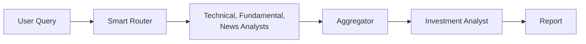

# ThinkOnlyOnce

**Stock Market Multi-Agent Analysis System**

An educational demonstration of agentic coding concepts using LangChain and LangGraph. This project showcases how multiple AI agents can collaborate to analyze US equity stocks.

## Purpose

This project was created to demonstrate **LangChain** and **LangGraph** capabilities to colleagues. It serves as a practical example of:
- Building multi-agent systems with LangGraph's state management
- Implementing intelligent routing patterns with LangChain
- Creating modular, extensible AI agent architectures
- Integrating real-world data sources (financial APIs, news) with LLM reasoning

## Features

- **Smart Routing**: LLM-based query router that determines which analysis agents to invoke
- **Multi-Agent Architecture**: Specialized agents for technical, fundamental, and news analysis
- **AI Investment Outlook**: Synthesizes all analyses into actionable investment recommendations
- **Flexible Configuration**: YAML-based configuration for LLM settings

## Quick Start

```bash
# Install dependencies
make install

# Activate virtual environment
source venv/bin/activate

# Set your OpenAI API key
export OPENAI_API_KEY=your-openai-api-key

# Run analysis
thinkonlyonce "Analyze NVDA stock"
```

## Usage Examples

```bash
# Full analysis (all agents invoked)
thinkonlyonce "Analyze NVDA stock"

# News only
thinkonlyonce "What's the latest news on AAPL?"

# Technical only
thinkonlyonce "Check TSLA price and trends"

# Fundamental only
thinkonlyonce "Is MSFT overvalued?"

# Combined (technical + news)
thinkonlyonce "GOOGL price action and recent headlines"
```

## Architecture



The system uses a supervisor pattern where an LLM-based router analyzes the user's query and determines which specialist agents to invoke, optimizing for efficiency and relevance.

## Agents

| Agent | Role | Data Source |
|-------|------|-------------|
| Smart Router | Query analysis & routing | LLM |
| Technical Analyst | Price & volume analysis | yfinance |
| Fundamental Analyst | Financial health analysis | yfinance |
| News Analyst | Market sentiment | DuckDuckGo |
| Investment Analyst | AI outlook & recommendations | LLM |

## Documentation

- [Software Design Document](docs/SDD.md) - Architecture and design decisions
- [Implementation Guide](docs/IMPLEMENTATION.md) - Code details and configuration
- [Demo Guide](docs/DEMO.md) - Presentation script for colleagues

## Development

```bash
# Install with dev dependencies
make install-dev

# Run linting and type checks
make check

# Run tests
make test

# Format code
make format
```

## Requirements

- Python 3.11+
- OpenAI API key (or any OpenAI-compatible endpoint)

## Configuration

The system is pre-configured to use OpenAI's API. You can customize the model or use alternative providers by editing `src/think_only_once/config/config.yaml`:

**Default (OpenAI):**
```yaml
llm:
  model: "gpt-4o-mini"
  base_url: null  # Uses default OpenAI endpoint
  # Set OPENAI_API_KEY environment variable
```

**For local models (Ollama, vLLM, etc.):**
```yaml
llm:
  model: "llama3.1"
  base_url: "http://localhost:11434/v1"
  api_key: "not-needed"
```

See [Implementation Guide](docs/IMPLEMENTATION.md#8-configuration-examples) for more examples.

## License

MIT License - See [LICENSE](LICENSE) for details.

---

*Built with LangChain and LangGraph*
