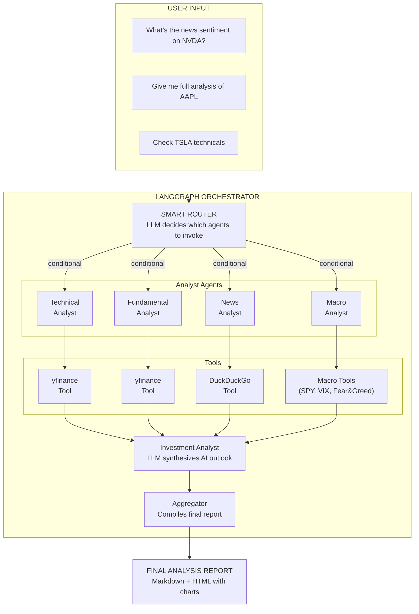
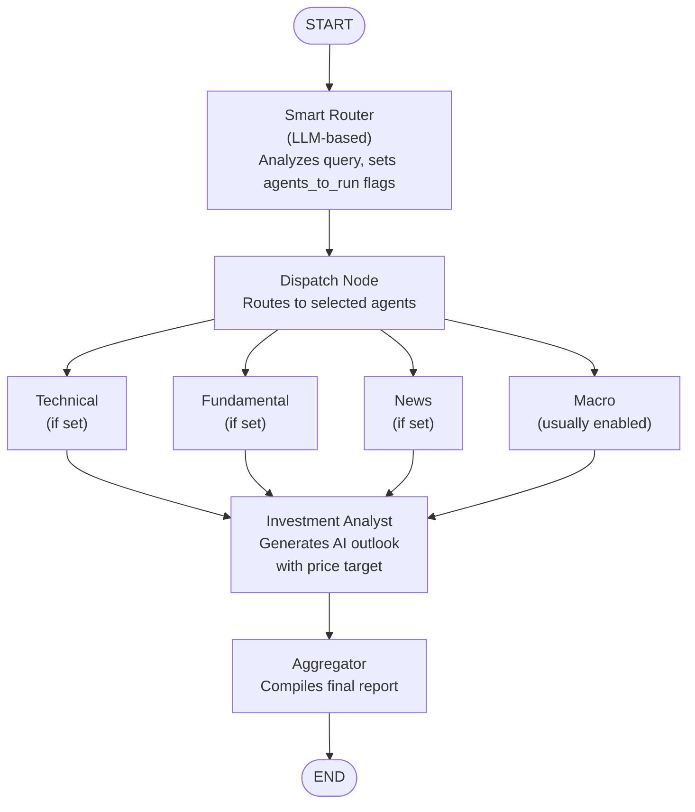

# Software Design Document

## Stock Market Multi-Agent Analysis System

**Version:** 2.0  
**Status:** Active  
**Purpose:** Multi-agent stock analysis system for personal use and portfolio demonstration

---

## Table of Contents

1. [Executive Summary](#1-executive-summary)
2. [System Architecture](#2-system-architecture)
3. [Component Specifications](#3-component-specifications)
4. [Data Models](#4-data-models)
5. [Output Formats](#5-output-formats)
6. [Appendix](#6-appendix)

---

## 1. Executive Summary

### 1.1 Project Goal

Build a multi-agent system that analyzes US equity stocks using specialized AI agents orchestrated by LangGraph. Originally created as an educational demonstration for colleagues, the project evolved into a practical tool for personal stock research and portfolio showcase.

### 1.2 Key Takeaways

1. **Agents** = LLM + Tools + Reasoning loop
2. **Tools** = Functions the LLM can call to interact with external systems
3. **LangGraph** = Orchestration layer that coordinates multiple agents
4. **State** = Shared context that flows between agents

---

## 2. System Architecture

### 2.1 High-Level Architecture



### 2.2 LangGraph State Flow



### 2.3 Router Decision Examples

| User Query | Router Decision | Agents Invoked |
|------------|-----------------|----------------|
| "Analyze NVDA" | Full analysis | Technical, Fundamental, News, Macro |
| "What's the news on AAPL?" | News only | News, Macro |
| "Check TSLA technicals" | Technical only | Technical, Macro |
| "Is MSFT overvalued?" | Fundamental | Fundamental, Macro |
| "GOOGL price and news" | Technical + News | Technical, News, Macro |

> **Note:** Macro analysis is enabled by default for most queries to provide market-wide context.

---

## 3. Component Specifications

### 3.1 Agents Overview

| Agent | Role | Tool | Data Retrieved |
|-------|------|------|----------------|
| **Smart Router** | Query analysis & routing | None (LLM only) | Decides which agents to invoke |
| Technical Analyst | Price & volume analysis | yfinance | Historical prices, volume, moving averages |
| Fundamental Analyst | Financial health analysis | yfinance | P/E ratio, market cap, revenue, EPS |
| News Analyst | Market sentiment analysis | DuckDuckGo | Recent news articles, headlines |
| Macro Analyst | Market-wide risk context | yfinance, CNN API, DuckDuckGo | SPY, VIX, sector ETFs, Fear & Greed, geopolitical news |
| **Investment Analyst** | AI outlook & recommendations | None (LLM only) | Synthesizes all data into investment thesis |

### 3.2 Smart Router (Supervisor)

**Purpose:** Analyze user query to determine which specialist agents should be invoked.

**Tool:** None (uses LLM with structured output)

**Routing Logic:**
- Extract ticker symbol from query
- Analyze intent to determine required analyses
- Set boolean flags for each agent

**Output Format:**
```python
{
    "ticker": "NVDA",
    "run_technical": True,
    "run_fundamental": False,
    "run_news": True,
    "run_macro": True,
    "reasoning": "User asked about price and news, no valuation questions"
}
```

### 3.3 Technical Analyst Agent

**Purpose:** Analyze price action, trends, and technical indicators.

**Tool:** `yfinance_technical_tool`

**Data Points:**
- Current price
- 52-week high/low
- 50-day moving average
- 200-day moving average
- Volume (current vs average)
- Price change (daily, weekly, monthly)

**Output Format:**
```python
{
    "agent": "technical_analyst",
    "ticker": "NVDA",
    "analysis": {
        "current_price": 875.50,
        "trend": "BULLISH",  # BULLISH | BEARISH | NEUTRAL
        "support_level": 800.00,
        "resistance_level": 950.00,
        "volume_signal": "ABOVE_AVERAGE",
        "summary": "Stock is trading above both 50-day and 200-day MA..."
    }
}
```

### 3.4 Fundamental Analyst Agent

**Purpose:** Evaluate company financial health and valuation.

**Tool:** `yfinance_fundamental_tool`

**Data Points:**
- Market capitalization
- P/E ratio (trailing & forward)
- EPS (earnings per share)
- Revenue & revenue growth
- Profit margins
- Debt-to-equity ratio
- Dividend yield (if applicable)

**Output Format:**
```python
{
    "agent": "fundamental_analyst",
    "ticker": "NVDA",
    "analysis": {
        "market_cap": "2.1T",
        "pe_ratio": 65.4,
        "valuation": "OVERVALUED",  # UNDERVALUED | FAIR | OVERVALUED
        "growth_outlook": "STRONG",
        "financial_health": "EXCELLENT",
        "summary": "Strong fundamentals with high growth, but elevated P/E..."
    }
}
```

### 3.5 News Analyst Agent

**Purpose:** Gather and analyze recent news sentiment.

**Tool:** `duckduckgo_search_tool`

**Data Points:**
- Recent news headlines (last 7 days)
- News sentiment analysis
- Key topics/themes
- Notable events (earnings, product launches, etc.)

**Output Format:**
```python
{
    "agent": "news_analyst",
    "ticker": "NVDA",
    "analysis": {
        "sentiment": "POSITIVE",  # POSITIVE | NEGATIVE | NEUTRAL | MIXED
        "key_headlines": [
            "NVIDIA reports record Q4 earnings...",
            "AI demand continues to surge..."
        ],
        "themes": ["AI", "Data Centers", "Gaming"],
        "summary": "Predominantly positive news driven by AI demand..."
    }
}
```

### 3.6 Macro Analyst Agent

**Purpose:** Assess market-wide conditions and systemic risk factors that may impact the stock.

**Tools:** `get_market_indices`, `search_geopolitical_news`

**Data Points:**
- **Market Health (SPY):** Price, 50-day MA, 200-day MA, daily change
- **Market Volatility (VIX):** Current level, daily change
- **Sector Performance:** Relevant sector ETF performance (e.g., XLK for Technology)
- **Market Sentiment:** CNN Fear & Greed Index (0-100 scale)
- **Geopolitical Risks:** Recent headlines on conflicts, sanctions, global economic concerns

**Output Format:**
```python
{
    "agent": "macro_analyst",
    "analysis": {
        "market_trend": "BULLISH",  # BULLISH | BEARISH | NEUTRAL
        "spy_status": "Trading above 50-day and 200-day MA",
        "vix_level": 15.2,
        "vix_interpretation": "LOW",  # LOW (<20) | ELEVATED (20-30) | HIGH (>30)
        "fear_greed": 65,
        "fear_greed_label": "Greed",
        "sector_performance": "Technology sector +1.2% today",
        "geopolitical_risks": [
            "Trade tensions remain elevated...",
            "Central bank policy uncertainty..."
        ],
        "summary": "Market conditions are favorable with low volatility..."
    }
}
```

### 3.7 Investment Analyst Agent

**Purpose:** Synthesize all analysis data and generate AI-powered investment outlook with actionable recommendations.

**Tool:** None (uses LLM to synthesize data)

**Input Data:**
- Technical analysis results
- Fundamental analysis results
- News/sentiment analysis results
- Macro analysis results (market conditions, volatility, sentiment)

**Output Components:**
- **Recommendation:** BUY / HOLD / SELL with confidence level
- **Price Target:** Specific price with methodology
- **Risk Assessment:** LOW / MEDIUM / HIGH with key risks
- **Investment Thesis:** 2-3 sentence summary

**Output Format:**
```python
{
    "agent": "investment_analyst",
    "ticker": "NVDA",
    "outlook": {
        "recommendation": "BUY",
        "confidence": "HIGH",
        "price_target": 950.00,
        "price_target_upside": "+8.5%",
        "methodology": "Based on forward P/E of 55x applied to projected FY25 EPS",
        "risk_level": "MEDIUM",
        "key_risks": [
            "Elevated valuation vs. sector peers",
            "Dependency on AI/datacenter demand",
            "Potential margin compression from competition"
        ],
        "thesis": "NVDA presents a compelling opportunity driven by AI infrastructure demand. Strong revenue growth and market leadership offset premium valuation."
    }
}
```

---

## 4. Data Models

### 4.1 LangGraph State Schema

```python
from typing import TypedDict, Annotated
from langgraph.graph.message import add_messages

class AnalysisState(TypedDict):
    """Shared state across all agents in the graph."""
    
    # Input
    ticker: str
    query: str  # Original user query for router analysis
    
    # Router decisions (set by smart router)
    run_technical: bool
    run_fundamental: bool
    run_news: bool
    run_macro: bool
    
    # Agent outputs
    technical_analysis: str | None
    fundamental_analysis: str | None
    news_analysis: str | None
    macro_analysis: str | None
    
    # Investment Analyst output
    ai_outlook: str | None
    
    # Final output
    final_report: str | None
    
    # Message history (for debugging)
    messages: Annotated[list, add_messages]
```

### 4.2 Router Output Schema

```python
from pydantic import BaseModel, Field

class RouterDecision(BaseModel):
    """Output from the smart router."""
    
    ticker: str = Field(description="Extracted stock ticker symbol")
    run_technical: bool = Field(
        description="True if technical analysis is needed (price, trends, volume)"
    )
    run_fundamental: bool = Field(
        description="True if fundamental analysis is needed (valuation, financials)"
    )
    run_news: bool = Field(
        description="True if news analysis is needed (sentiment, headlines)"
    )
    run_macro: bool = Field(
        default=True,
        description="True if macro analysis is needed (usually enabled)"
    )
    reasoning: str = Field(
        description="Brief explanation of routing decision"
    )
```

### 4.3 Tool Output Schemas

```python
from pydantic import BaseModel, Field

class TechnicalData(BaseModel):
    """Output schema for technical analysis tool."""
    
    current_price: float | None = Field(description="Current stock price")
    price_change_pct: float | None = Field(description="Year-to-date price change percentage")
    fifty_day_ma: float | None = Field(description="50-day moving average")
    two_hundred_day_ma: float | None = Field(description="200-day moving average")
    fifty_two_week_high: float | None = Field(description="52-week high price")
    fifty_two_week_low: float | None = Field(description="52-week low price")
    volume: int | None = Field(description="Last trading volume")
    avg_volume: int | None = Field(description="3-month average volume")


class FundamentalData(BaseModel):
    """Output schema for fundamental analysis tool."""
    
    market_cap: int | None = Field(description="Market capitalization in USD")
    pe_ratio: float | None = Field(description="Trailing P/E ratio")
    forward_pe: float | None = Field(description="Forward P/E ratio")
    eps: float | None = Field(description="Earnings per share")
    revenue: int | None = Field(description="Total revenue in USD")
    profit_margin: float | None = Field(description="Profit margin percentage")
    debt_to_equity: float | None = Field(description="Debt to equity ratio")
    dividend_yield: float | None = Field(description="Dividend yield percentage")
    sector: str | None = Field(description="Company sector")
    industry: str | None = Field(description="Company industry")


class NewsData(BaseModel):
    """Output schema for news search tool."""
    
    headlines: list[str] = Field(default_factory=list, description="List of news headlines")
    snippets: list[str] = Field(default_factory=list, description="List of news snippets")
    search_query: str = Field(description="The search query used")


class FearGreedData(BaseModel):
    """CNN Fear & Greed Index data."""
    
    value: int | None = None  # 0-100 scale
    label: str | None = None  # Extreme Fear, Fear, Neutral, Greed, Extreme Greed


class MarketIndicesData(BaseModel):
    """Market indices data for macro risk assessment."""
    
    # SPY (S&P 500 ETF)
    spy_price: float | None = Field(default=None, description="Current SPY price")
    spy_50d_ma: float | None = Field(default=None, description="SPY 50-day moving average")
    spy_200d_ma: float | None = Field(default=None, description="SPY 200-day moving average")
    spy_change_pct: float | None = Field(default=None, description="SPY daily change %")
    
    # VIX (Volatility Index)
    vix_level: float | None = Field(default=None, description="Current VIX level")
    vix_change_pct: float | None = Field(default=None, description="VIX daily change %")
    
    # Sector ETF
    sector_etf: str | None = Field(default=None, description="Sector ETF symbol (e.g., XLK)")
    sector_price: float | None = Field(default=None, description="Sector ETF price")
    sector_50d_ma: float | None = Field(default=None, description="Sector ETF 50-day MA")
    sector_change_pct: float | None = Field(default=None, description="Sector ETF daily change %")
    
    # Fear & Greed Index
    fear_greed_value: int | None = Field(default=None, description="CNN Fear & Greed (0-100)")
    fear_greed_label: str | None = Field(default=None, description="Fear & Greed label")


class GeopoliticalNewsData(BaseModel):
    """Geopolitical news search results."""
    
    headlines: list[str] = Field(default_factory=list, description="News headlines")
    snippets: list[str] = Field(default_factory=list, description="News snippets")
    search_query: str = Field(default="", description="Search query used")


class PricePoint(BaseModel):
    """Single price data point for historical chart."""
    
    date: str = Field(description="Date in YYYY-MM-DD format")
    open: float = Field(description="Opening price")
    high: float = Field(description="High price")
    low: float = Field(description="Low price")
    close: float = Field(description="Closing price")
    volume: int = Field(description="Trading volume")


class PriceHistory(BaseModel):
    """Historical price data for chart visualization."""
    
    ticker: str = Field(description="Stock ticker symbol")
    period: str = Field(description="Time period (e.g., 6mo, 1y)")
    data: list[PricePoint] = Field(default_factory=list, description="Historical OHLCV data")
```

---

## 5. Output Formats

### 5.1 Markdown Report

The default output is a structured markdown report with sections for each analysis type:

```markdown
# Stock Analysis Report: NVDA

## Technical Analysis
...

## Fundamental Analysis
...

## News & Sentiment Analysis
...

## Macro Analysis
...

## AI Investment Outlook
**Recommendation:** BUY (High Confidence)
**Price Target:** $150 (+15% from current)
**Investment Thesis:** ...
```

### 5.2 HTML Report

An optional HTML report is generated with:
- **Apple-inspired design** with clean typography and subtle gradients
- **Interactive SVG price chart** showing historical price movement with gradient fill
- **Collapsible sections** for each analysis type
- **Responsive layout** for mobile and desktop
- **Recommendation badges** with color-coded styling (green=BUY, orange=HOLD, red=SELL)

The HTML report is saved to the `reports/` directory with timestamp: `{TICKER}_analysis_{YYYY-MM-DD_HHMMSS}.html`

---

## 6. Appendix

### 6.1 Glossary

| Term | Definition |
|------|------------|
| **Agent** | An LLM with access to tools that can reason and take actions |
| **Tool** | A function the LLM can invoke to retrieve data or perform actions |
| **Chain** | A sequence of operations (prompt → LLM → output parser) |
| **Graph** | A workflow defined as nodes (processors) and edges (connections) |
| **State** | A typed dictionary that flows through the graph, accumulating data |
| **Node** | A processing step in a LangGraph (can be an agent or function) |
| **Edge** | A connection between nodes defining execution flow |

### 6.2 Design Decisions

1. **Supervisor Pattern**: Using an LLM-based router allows intelligent query understanding rather than keyword matching.

2. **Lazy Agent Initialization**: Agents are only created when needed, improving startup time.

3. **Sequential Flow**: Analysts run sequentially for simplicity; can be parallelized for performance.

4. **Modular Architecture**: Each agent is independent and can be tested/replaced individually.

5. **Class-based Orchestrator**: Encapsulates graph construction and agent lifecycle management.

6. **Direct LangChain create_agent Usage**: Each agent directly imports and uses `langchain.agents.create_agent` with the shared `get_llm()` function. This provides:
   - Explicit dependency on LangChain's ReAct implementation
   - No unnecessary wrapper abstraction (KISS principle)
   - Standard `{"messages": [...]}` interface for consistency
   - Centralized LLM configuration via `get_llm()` while keeping agent creation explicit

### 6.3 Future Extensibility

**Implemented (v2.0):**
- ✅ Macro Analyst for market-wide context (SPY, VIX, Fear & Greed)
- ✅ HTML report generation with interactive charts
- ✅ Sector-specific ETF analysis

**Potential Future Enhancements:**

1. **Add more agents:**
   - Risk Assessment Agent
   - Portfolio Optimization Agent
   - Earnings Calendar Agent
   - Competitor Analysis Agent
   - Options Flow Agent

2. **Enhanced routing:**
   - Multi-turn conversations (router tracks context)
   - Confidence scores in routing decisions
   - Fallback to full analysis if uncertain

3. **Parallel execution:**
   - Run selected agents concurrently
   - Use `asyncio` for better performance

4. **Human-in-the-loop:**
   - Router asks clarifying questions
   - User confirms before expensive analyses
   - Feedback loop for router improvement

5. **Persistence:**
   - Save analysis history
   - Cache frequent queries
   - Track routing accuracy

### 6.4 Resources

- [LangChain Docs](https://python.langchain.com/docs/)
- [LangGraph Docs](https://langchain-ai.github.io/langgraph/)
- [yfinance Docs](https://pypi.org/project/yfinance/)
- [OpenAI API](https://platform.openai.com/docs/)

---

*Document Version: 2.0*  
*Created: January 2026*  
*Updated: February 2026*
